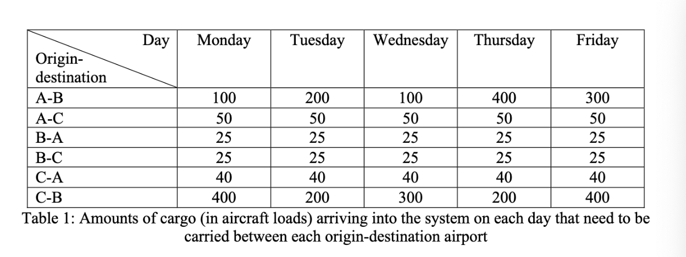
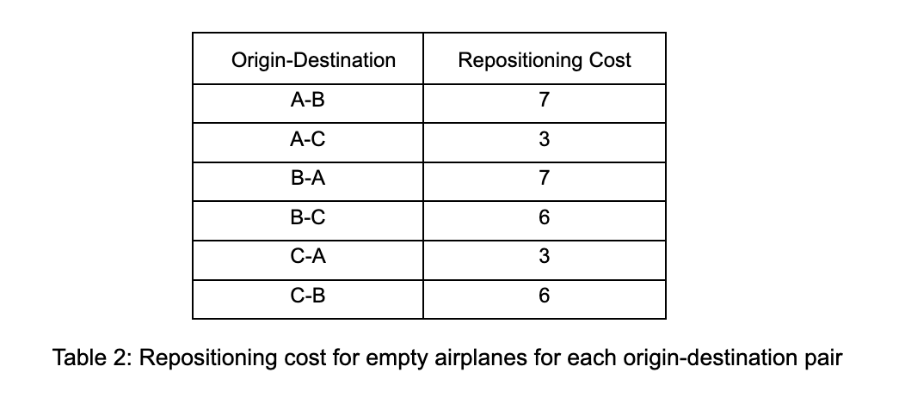
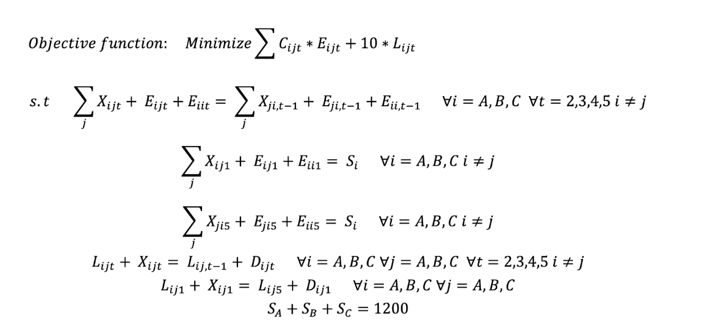
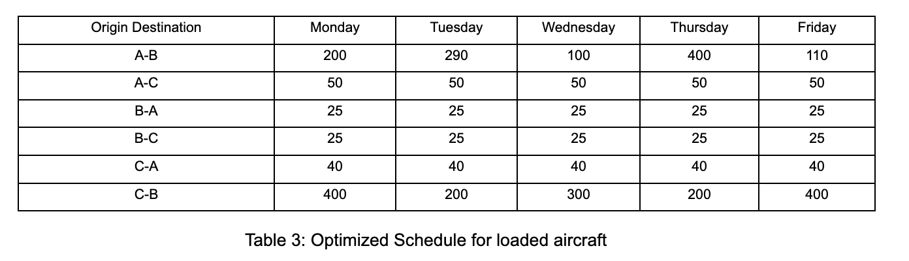
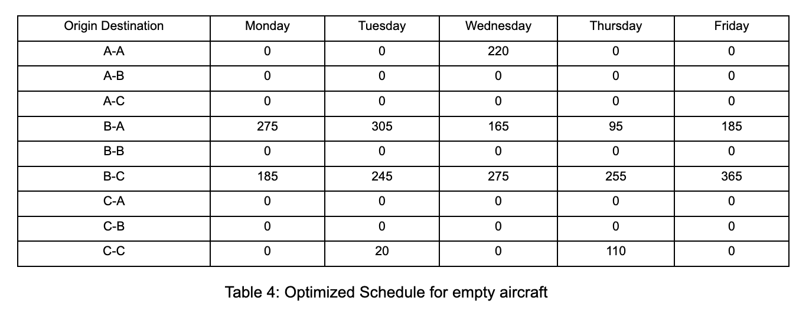
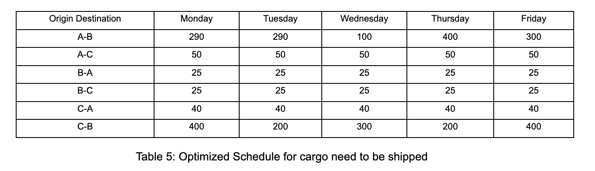
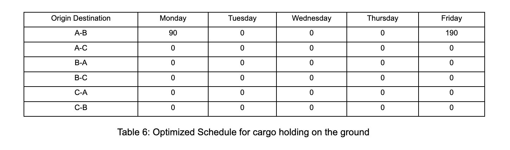
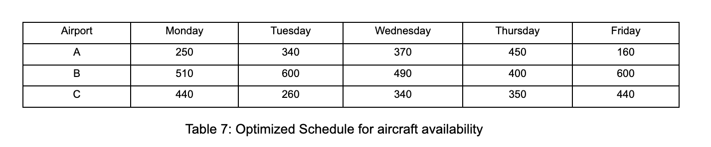

# Cargo Operations of Express Air Report
# Summary
This report serves as the final project report for the ORIE5380 Optimization course over the time period of Fall 2022.
In this report, we formulate a mixed integer linear program to solve for the optimal cargo shipping schedule for Express Air. We reach an optimal cost of 17925 given 1200 aircraft and a set of constraints. By doing sensitivity analysis, we find that we can decrease the cost by increasing the fleet size and amount of incoming cargo in some scenarios. We can decrease the cost by 20 by adding one aircraft to the fleet. The rate of decrease is maintained until the fleet size increases to 1282. To decrease the cost by adding the amount of cargo needed to be shipped, the most beneficial way is to increase the cargo needed to be shipped from B to A. One unit of increase of cargo gives us a 7 decrease in total cost. Similarly, we can decrease the number of cargo needed to be shipped from A to B on Friday to decrease the total cost by 27/unit.
# Problem Overview
Logistic problem is a classical problem in the field of optimization. Express Air runs a cargo shipping business via air transportation. In this project, I optimized the cargo operations of Express Air to minimize the cost of operation. Express Air has 1200 aircraft that carry cargo among 3 airports. It has a cargo schedule that shows the amount of cargo that comes in one airport to be carried from the airport to another on each day. For example, the amount of cargo that needs to be shipped from airport A to airport B is 100. The schedule is shown later. However, we don't need to ship all the cargo available for each day. We can let some cargo stay at the airport, which will incur a cost for holding the cargo on the ground. So the number of cargo needed to be shipped in total for each is the sum of incoming cargo and existing cargo.
The amount of cargo that can be delivered between an origin-destination pair depends on the number of aircraft at the origin. In addition to carrying cargo, the operator can also reposition empty aircraft between airports to make sure cargo could be shipped properly, which also encounters a repositioning cost. The cargo operations are dynamic, with aircraft becoming available at their destination the day after they move.
Considering the cargo holding cost and aircraft repositioning cost, we want to come up with an optimal cargo shipping schedule to minimize these costs.
# Data Description
The total number of aircraft is 1200.  
The incoming cargo schedule is shown below:

The cost for keeping one unit of cargo on the ground for one day is 10.  
The repositioning cost of empty flight is shown below:

# Overview of the optimization model
In our optimization model, our objective is to minimize the cost of cargo shipping. Since the total number of cargo needed to be shipped is fixed, we don’t need to consider the cost for cargo shipping. In our cost function, we just need to consider the cargo holding cost and repositioning cost.
One key point for our decision variables is that, since we consider the number of cargo and number of aircraft as integers, our decision variables and final shipping schedule should hold integer values. We set up four types of integer decision variables:
(1) Xijt: Number of aircraft with a load of cargo from airport i to airport j on day t  
(2) Eijt: Number of empty aircraft from airport i to airport j on day t (i = j means the number of aircraft stay at airport i on day t)  
(3) Lijt: Number of unshipped cargo from airport i to airport j on day t  
(4) Si: Number of aircraft available on Monday for airport i  
 
We also need to set up the constraints for the optimization problem. We need four types of constraints:  
(1) Aircraft flow constraint: Total number of aircraft coming into the airport (including aircraft staying at the airport) by the end of previous day equals total number of aircraft coming out of the airport on the current day. Friday is linked to Monday to form a cycle  
(2) Special flow constraint for Monday and Friday: To keep a weekly cycle, we need the number of aircraft staying at each airport at the beginning of the week and at the end of the week to be equal. This means that the total number of aircraft going out of each airport is the same as the total number of aircrafts coming into the airport by the end of Friday and equal to a fixed number  
(3) Cargo flow constraint: Number of cargo holding  from the previous day + number of cargo coming in today = Number of cargo shipped today + number of cargo holding today  
(4) Total number of aircraft constraint: The fixed number of aircraft at the beginning of the week at each airports sum up to 1200

# Mathematical Details
The formulation of the optimization problem is as below:  
(1) Xijt: Number of aircraft with a load of cargo from airport i to airport j on day t  
(2) Eijt: Number of empty aircraft from airport i to airport j on day t (i = j means the number of aircrafts stay at airport i on day t)  
(3) Lijt: Number of unshipped cargo from airport i to airport j on day t  
(4) Si: Number of aircraft available on Monday for airport i  
(5) Cij: Repositioning of flight from airport i to airport j  
(6) Dijt: Cargo coming in to ship from airport i to airport j on day t  

# Optimized Schedule
### Optimal cost: 17925  
### Optimized Schedule for loaded aircraft:  

### Optimized Schedule for empty aircrafts:

### Optimized Schedule for cargo need to shipped (Lij,t-1 + Dijt):

### Optimized Schedule for cargo holding on the ground:

### Amount of aircrafts available on Monday:

 SA = 250, SB = 510, SC = 440 

### Number aircrafts available each day for each airport:

