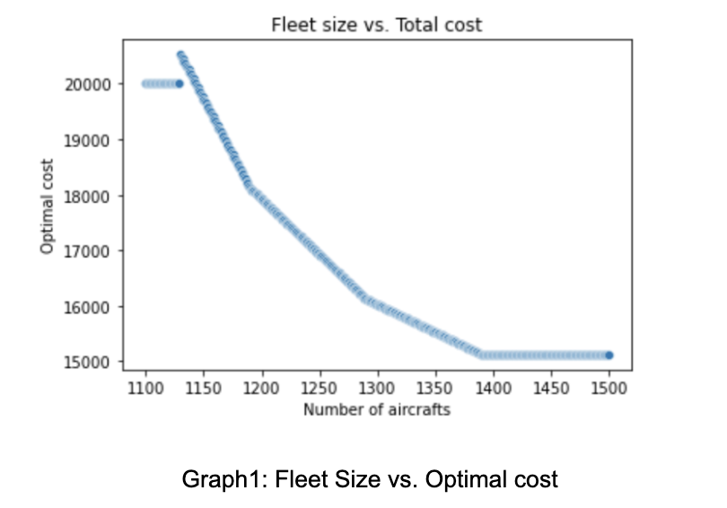
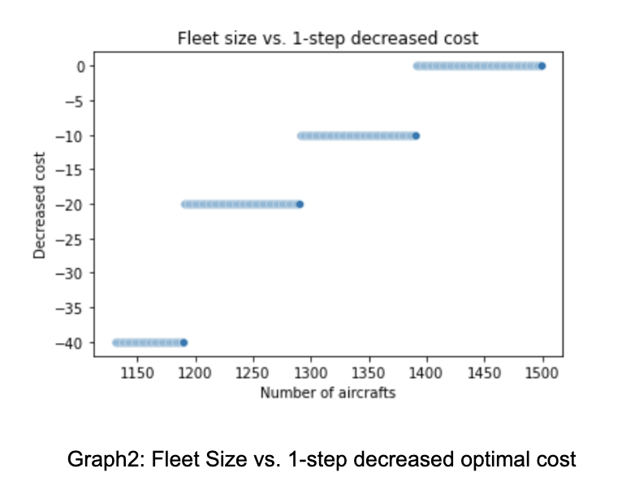

# Cargo Operations of Express Air Report
# Summary
This report serves as the final project report for the ORIE5380 Optimization course over the time period of Fall 2022.
In this report, we formulate a mixed integer linear program to solve for the optimal cargo shipping schedule for Express Air. We reach an optimal cost of 17925 given 1200 aircraft and a set of constraints. By doing sensitivity analysis, we find that we can decrease the cost by increasing the fleet size and amount of incoming cargo in some scenarios. We can decrease the cost by 20 by adding one aircraft to the fleet. The rate of decrease is maintained until the fleet size increases to 1282. To decrease the cost by adding the amount of cargo needed to be shipped, the most beneficial way is to increase the cargo needed to be shipped from B to A. One unit of increase of cargo gives us a 7 decrease in total cost. Similarly, we can decrease the number of cargo needed to be shipped from A to B on Friday to decrease the total cost by 27/unit.
# Problem Overview
Logistic problem is a classical problem in the field of optimization. Express Air runs a cargo shipping business via air transportation. In this project, I optimized the cargo operations of Express Air to minimize the cost of operation. Express Air has 1200 aircraft that carry cargo among 3 airports. It has a cargo schedule that shows the amount of cargo that comes in one airport to be carried from the airport to another on each day. For example, the amount of cargo that needs to be shipped from airport A to airport B is 100. The schedule is shown later. However, we don't need to ship all the cargo available for each day. We can let some cargo stay at the airport, which will incur a cost for holding the cargo on the ground. So the number of cargo needed to be shipped in total for each is the sum of incoming cargo and existing cargo.
The amount of cargo that can be delivered between an origin-destination pair depends on the number of aircraft at the origin. In addition to carrying cargo, the operator can also reposition empty aircraft between airports to make sure cargo could be shipped properly, which also encounters a repositioning cost. The cargo operations are dynamic, with aircraft becoming available at their destination the day after they move.
Considering the cargo holding cost and aircraft repositioning cost, we want to come up with an optimal cargo shipping schedule to minimize these costs.
# Data Description
The total number of aircraft is 1200.  
The incoming cargo schedule is shown below:

The cost for keeping one unit of cargo on the ground for one day is 10.  
The repositioning cost of empty flight is shown below:

# Overview of the optimization model
In our optimization model, our objective is to minimize the cost of cargo shipping. Since the total number of cargo needed to be shipped is fixed, we don’t need to consider the cost for cargo shipping. In our cost function, we just need to consider the cargo holding cost and repositioning cost.
One key point for our decision variables is that, since we consider the number of cargo and number of aircraft as integers, our decision variables and final shipping schedule should hold integer values. We set up four types of integer decision variables:
(1) Xijt: Number of aircraft with a load of cargo from airport i to airport j on day t  
(2) Eijt: Number of empty aircraft from airport i to airport j on day t (i = j means the number of aircraft stay at airport i on day t)  
(3) Lijt: Number of unshipped cargo from airport i to airport j on day t  
(4) Si: Number of aircraft available on Monday for airport i  
 
We also need to set up the constraints for the optimization problem. We need four types of constraints:  
(1) Aircraft flow constraint: Total number of aircraft coming into the airport (including aircraft staying at the airport) by the end of previous day equals total number of aircraft coming out of the airport on the current day. Friday is linked to Monday to form a cycle  
(2) Special flow constraint for Monday and Friday: To keep a weekly cycle, we need the number of aircraft staying at each airport at the beginning of the week and at the end of the week to be equal. This means that the total number of aircraft going out of each airport is the same as the total number of aircrafts coming into the airport by the end of Friday and equal to a fixed number  
(3) Cargo flow constraint: Number of cargo holding  from the previous day + number of cargo coming in today = Number of cargo shipped today + number of cargo holding today  
(4) Total number of aircraft constraint: The fixed number of aircraft at the beginning of the week at each airports sum up to 1200

# Mathematical Details
The formulation of the optimization problem is as below:  
(1) Xijt: Number of aircraft with a load of cargo from airport i to airport j on day t  
(2) Eijt: Number of empty aircraft from airport i to airport j on day t (i = j means the number of aircrafts stay at airport i on day t)  
(3) Lijt: Number of unshipped cargo from airport i to airport j on day t  
(4) Si: Number of aircraft available on Monday for airport i  
(5) Cij: Repositioning of flight from airport i to airport j  
(6) Dijt: Cargo coming in to ship from airport i to airport j on day t  

# Optimized Schedule
### Optimal cost: 17925  
### Optimized Schedule for loaded aircraft:  

### Optimized Schedule for empty aircrafts:

### Optimized Schedule for cargo need to shipped (Lij,t-1 + Dijt):

### Optimized Schedule for cargo holding on the ground:

### Amount of aircrafts available on Monday:

 SA = 250, SB = 510, SC = 440 

### Number aircrafts available each day for each airport:

In conclusion, our optimized solution is sensible because all the constraints are satisfied. We can see that on each origin-destination pair on each day, the number of loaded aircraft is smaller than or equal to the cargo available. Also, the total number of aircraft going out from each airport on each day is also equal to its aircraft availability. The cycle is maintained by fixed Monday aircraft availability for all three airports. We can see that the total number of aircraft available on each day is 1200. By satisfying all the constraints, we can see that our model tried to keep the number of cargo held on the ground at a low level. This is intuitive because we can see that the cost for one unit of cargo held on the ground for one day is 10. This number is larger than the repositioning cost for aircraft for any origin-destination pair. So we always want to reposition an empty aircraft to eliminate the cargo holding on the ground if possible. Our model did an excellent job on this task; thus, we believe our optimal solution is sensible.

# Economic Analysis
Based on our model, we want to examine how our optimal cost would be influenced if we increase or decrease the fleet size. We do this by changing the Total number of aircraft constraints. We tried 400 different fleet sizes from 1100 to 1500, optimized our model based on the new constraint, and obtained the corresponding optimal cost. Below is the plot of optimal cost given each fleet size:

  

We set the optimal cost to 20000 when we got an infeasible model to make better visualization, so the infeasible region is shown by the horizontal line on the left of the graph. The model became feasible when the fleet size reached 1130. The optimal cost is 20525. The minimum fleet size to be able to ship the above schedule is 1130. The optimal cost decreases at three different rates as the fleet size increases and finally stops to decrease around a fleet size of 1380. This shows that we don’t need more than around 1380 aircraft to reduce the cost of shipping the current schedule. We want to see the rate of change for the optimal cost, and we do this by taking the first difference of the optimal cost.

  

When we have a fleet size of 1200, the decreased cost driven by one unit increase in fleet size is 20. It shows that if we now add one aircraft to the fleet, we can reduce the optimal cost by 20. It will be a good choice if the cost of adding one aircraft is smaller than 20. Similarly, if we decrease one aircraft from our fleet, the cost will rise by 20.  
We also want to examine the cost of increasing cargo availability. This is more complicated to implement, and it will be helpful if we can solve the dual problem of our linear program and obtain the sensitivity report, which shows important statistics like shadow price. Normally, a mixed integer program does not have a dual problem to solve, and hence we don’t have a sensitivity report. But luckily, our linear program has a totally unimodular matrix on the left-hand side, which we could formulate as a normal linear program by setting all decision variables to continuous type and still obtain an optimal integer solution. By doing so, we obtain the following sensitivity report on our constraints (see Appendix I). Pi represents the shadow price, which shows the change in optimal value if we increase the right-hand side (constraint) by one unit. SARHSLow and SARHUp are the lower and upper bounds of the shadow price to be presented. For incoming cargo on Monday from B to A, if we increase the incoming cargo by one unit, our cost will decrease by 7. We can increase the amount of cargo to 300. This reduction is caused by switching one empty aircraft shipping on this origin-destination pair to a loaded aircraft. We also incur a reduction of 7 in cost for increasing cargo on Tuesday from B to A, Wednesday from B to A, Thursday from B to A, and Friday from B to A. We also observe that the cost will decrease by 6  if we increase the cargo needed to be shipped from B to C on all days. However, the story does not apply to all scenarios. We also observe positive shadow prices in some origin-destination pairs for some days, which means that an increase in cargo units will increase the cost of shipping. But we can decrease the number of cargo to decrease cost in these scenarios.
